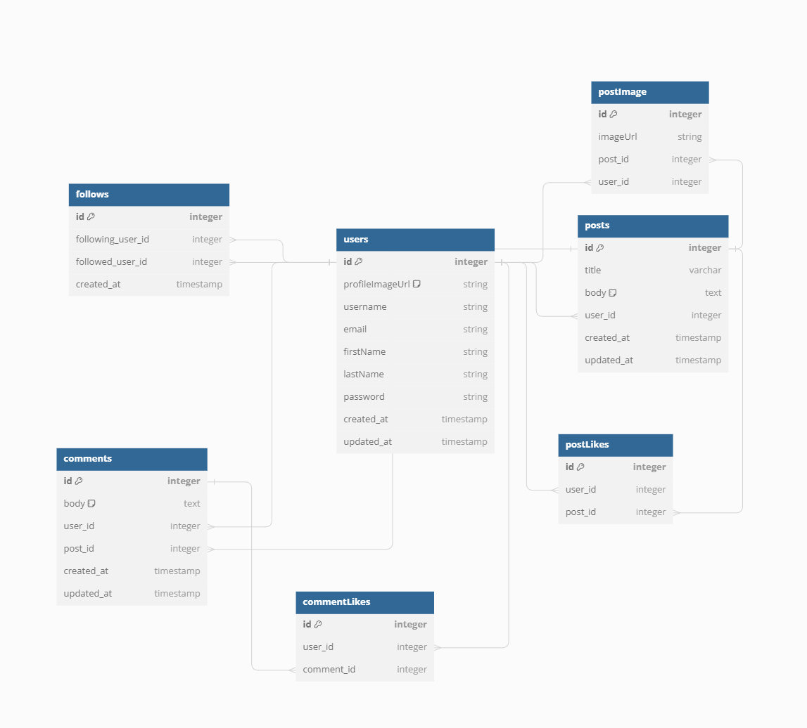

# LONDON IS BLUE

## Database Schema


## API Documentation

## USER AUTHENTICATION/AUTHORIZATION

### All endpoints that require authentication

All endpoints that require a current user to be logged in.

* Request: endpoints that require authentication
* Error Response: Require authentication
  * Status Code: 401
  * Headers:
    * Content-Type: application/json
  * Body:

    ```json
    {
      "message": "Authentication required"
    }
    ```

### All endpoints that require proper authorization

All endpoints that require authentication and the current user does not have the
correct role(s) or permission(s).

* Request: endpoints that require proper authorization
* Error Response: Require proper authorization
  * Status Code: 403
  * Headers:
    * Content-Type: application/json
  * Body:

    ```json
    {
      "message": "Forbidden"
    }
    ```

### Get the All User

Returns the information about the current user that is logged in.

* Require Authentication: true
* Request
  * Method: /GET
  * URL: /users/
  * Body: none

* Successful Response when there is a logged in user
  * Status Code: 200
  * Headers:
    * Content-Type: application/json
  * Body:

    ```json
    {
      "users": {
         "id": 1,
         "username": "iankimm",
         "firstName": "ian",
         "lastName": "kim",
         "email": "test@test.com",
         "image_url": "picture.jpg",
         "created_at": "00-00-0000"
      }
    }
    ```

* Successful Response when there is no logged in user
  * Status Code: 200
  * Headers:
    * Content-Type: application/json
  * Body:

    ```json
    {
      "user": null
    }
    ```

### Get the Current User

Returns the information about the current user that is logged in.

* Require Authentication: true
* Request
  * Method: /GET
  * URL: /users/:userId
  * Body: none

* Successful Response when there is a logged in user
  * Status Code: 200
  * Headers:
    * Content-Type: application/json
  * Body:

    ```json
    {
         "id": 1,
         "username": "iankimm",
         "firstName": "ian",
         "lastName": "kim",
         "email": "test@test.com",
         "image_url": "picture.jpg",
         "created_at": "00-00-0000"
    }
    ```

* Successful Response when there is no logged in user
  * Status Code: 200
  * Headers:
    * Content-Type: application/json
  * Body:

    ```json
    {
      "user": null
    }
    ```

### Log In a User

Logs in a current user with valid credentials and returns the current user's
information.

* Require Authentication: false
* Request
  * Method: /POST
  * URL: /users/login
  * Headers:
    * Content-Type: application/json
  * Body:

    ```json
    {
      "credential": "john.smith@gmail.com",
      "password": "secret password"
    }
    ```

* Successful Response
  * Status Code: 200
  * Headers:
    * Content-Type: application/json
  * Body:

    ```json
    {
         "id": 1,
         "username": "iankimm",
         "firstName": "ian",
         "lastName": "kim",
         "email": "test@test.com",
         "image_url": "picture.jpg",
         "created_at": "00-00-0000"
    }
    ```

* Error Response: Invalid credentials
  * Status Code: 401
  * Headers:
    * Content-Type: application/json
  * Body:

    ```json
    {
      "message": "Invalid credentials"
    }
    ```

* Error response: Body validation errors
  * Status Code: 400
  * Headers:
    * Content-Type: application/json
  * Body:

    ```json
    {
      "message": "Bad Request", // (or "Validation error" if generated by Sequelize),
      "errors": {
        "credential": "Email or username is required",
        "password": "Password is required"
      }
    }
    ```

### Sign Up a User

Creates a new user, logs them in as the current user, and returns the current
user's information.

* Require Authentication: false
* Request
  * Method: /POST
  * URL: /signup
  * Headers:
    * Content-Type: application/json
  * Body:

    ```json
      {
         "username": "iankimm",
         "firstName": "ian",
         "lastName": "kim",
         "password": "password",
         "email": "test@test.com",
         "image_url": "picture.jpg",
      }
    ```

* Successful Response
  * Status Code: 200
  * Headers:
    * Content-Type: application/json
  * Body:

    ```json
    {
         "id": 1,
         "username": "iankimm",
         "firstName": "ian",
         "lastName": "kim",
         "email": "test@test.com",
         "image_url": "picture.jpg",
         "created_at": "00-00-0000"
    }
    ```

## POSTS

### Get all Posts

Returns all the posts.

* Require Authentication: false
* Request
  * Method: /GET
  * URL: /posts
  * Body: none

* Successful Response
  * Status Code: 200
  * Headers:
    * Content-Type: application/json
  * Body:

    ```json
    {
      "Posts": [
        {
         "id": 1,
         "title": "this is sample title",
         "body": "this is sample body",
         "created_at": "00-00-0000",
         "user_id": 1
        }
      ]
    }
    ```

### Get all Posts owned by the Current User

Returns all the spots owned (created) by the current user.

* Require Authentication: true
* Request
  * Method: /GET
  * URL: /posts/current-user
  * Body: none

* Successful Response
  * Status Code: 200
  * Headers:
    * Content-Type: application/json
  * Body:

    ```json
    {
      "UserAllPosts": [
        {
         "id": 1,
         "title": "this is sample title",
         "body": "this is sample body",
         "created_at": "00-00-0000",
         "updated_at": "00-00-0001",
         "user_id": 1
        }
      ]
    }
    ```

### Get Post from an post id

Returns the details of a post specified by its id.

* Require Authentication: true
* Request
  * Method: /GET
  * URL: /posts/:postId
  * Body: none

* Successful Response
  * Status Code: 200
  * Headers:
    * Content-Type: application/json
  * Body:

    ```json
    {
      "Posts_all_details": [
        {
         "id": 1,
         "title": "this is sample title",
         "body": "this is sample body",
         "created_at": "00-00-0000",
         "updated_at": "00-00-0001",
         "user_id": 1
        }
      ]
    }
    ```

### Create a new Post

Creates and returns a new post.

* Require Authentication: true
* Request
  * Method: /POST
  * URL: /posts
  * Headers:
    * Content-Type: application/json
  * Body:

    ```json
    {
      "title": "this is sample title",
      "body": "this is sample body",
    }
    ```
* Successful Response
  * Status Code: 201
  * Headers:
    * Content-Type: application/json
  * Body:

    ```json
    {
      "id": 1,
      "title": "this is sample title",
      "body": "this is sample body",
      "created_at": "00-00-0000",
      "updated_at": "00-00-0001",
      "user_id": 1
    }
    ```

* Error Response: Body validation error
  * Status Code: 400
  * Headers:
    * Content-Type: application/json
  * Body:

    ```json
    {
      "message": "Bad Request",
      "errors": {
        "title": "title is required",
        "body": "body is required"
      }
    }
    ```

### Edit a Post
Updates and returns an existing post.

* Require Authentication: true
* Require proper authorization: post must belong to the current user
* Request
  * Method: /PUT
  * URL: /posts/:postId
  * Headers:
    * Content-Type: application/json
  * Body:

    ```json
    {
      "title": "this is sample title",
      "body": "this is sample body",
    }
    ```

* Successful Response
  * Status Code: 200
  * Headers:
    * Content-Type: application/json
  * Body:

    ```json
    {
      "id": 1,
      "title": "this is sample title",
      "body": "this is sample body",
      "created_at": "00-00-0000",
      "updated_at": "00-00-0001",
      "user_id": 1
    }
    ```

* Error Response: Body validation error
  * Status Code: 400
  * Headers:
    * Content-Type: application/json
  * Body:

    ```json
    {
      "message": "Bad Request",
      "errors": {
        "title": "title is required",
        "body": "body is required"
      }
    }
    ```

* Error response: Couldn't find a Spot with the specified id
  * Status Code: 404
  * Headers:
    * Content-Type: application/json
  * Body:

    ```json
    {
      "message": "Post not found."
    }
    ```

### Delete a Post

Deletes an existing post.

* Require Authentication: true
* Require proper authorization: Spot must belong to the current user
* Request
  * Method: /DELETE
  * URL: /posts/:postId
  * Body: none

* Successful Response
  * Status Code: 200
  * Headers:
    * Content-Type: application/json
  * Body:

    ```json
    {
      "message": "Post deleted."
    }
    ```

* Error response: Couldn't find a Post with the specified id
  * Status Code: 404
  * Headers:
    * Content-Type: application/json
  * Body:

    ```json
    {
      "message": "Post not found."
    }
    ```

### Create a post Image

Creates and returns a new post image.

* Require Authentication: true
* Request
  * Method: /POST
  * URL: /posts/:postId/images
  * Headers:
    * Content-Type: application/json
  * Body:

    ```json
    {
      "image_url": "image.jpg",
      "post_id": 1
    }
    ```
* Successful Response
  * Status Code: 201
  * Headers:
    * Content-Type: application/json
  * Body:

    ```json
    {
      "id": 1,
      "imageUrl": "image.jpg",
      "user_id": 1,
      "post_id": 1
    }
    ```

* Error response: Couldn't find a Post with the specified id
  * Status Code: 404
  * Headers:
    * Content-Type: application/json
  * Body:

    ```json
    {
      "message": "Post not found."
    }
    ```

### Delete a post Image

Deletes an existing post image.

* Require Authentication: true
* Require proper authorization: Post must belong to the current user
* Request
  * Method: /DELETE
  * URL: /posts/:postId/images/:imageId
  * Body: none

* Successful Response
  * Status Code: 200
  * Headers:
    * Content-Type: application/json
  * Body:

    ```json
    {
      "message": "Post Image deleted."
    }
    ```

* Error response: Couldn't find a Post with the specified id
  * Status Code: 404
  * Headers:
    * Content-Type: application/json
  * Body:

    ```json
    {
      "message": "Post not found."
    }
    ```

### Get all post Image

Returns the information about all post images.

* Require Authentication: true
* Request
  * Method: /GET
  * URL: /posts/images
  * Body: none

* Successful Response when there are post images
  * Status Code: 200
  * Headers:
    * Content-Type: application/json
  * Body:

    ```json
    {
      "PostImages": {
         "id": 1,
         "image_url": "image.jpg",
         "post_id": 1,
         "user_id": 1
      }
    }
    ```

* Successful Response when there is no post image
  * Status Code: 200
  * Headers:
    * Content-Type: application/json
  * Body:

    ```json
    {
      "PostImages": null
    }
    ```

## Post Likes

### Get all post likes

Returns the information about all post likes.

* Require Authentication: true
* Request
  * Method: /GET
  * URL: /postlikes
  * Body: none

* Successful Response when there are post likes
  * Status Code: 200
  * Headers:
    * Content-Type: application/json
  * Body:

    ```json
    {
      "Postlikes": {
         "id": 1,
         "post_id": 1,
         "user_id": 1
      }
    }
    ```

* Successful Response when there is no post likes
  * Status Code: 200
  * Headers:
    * Content-Type: application/json
  * Body:

    ```json
    {
      "Postlikes": null
    }
    ```

### Create a new post like

Creates and returns a new post like.

* Require Authentication: true
* Request
  * Method: /POST
  * URL: /postlikes/:post_id/likes
  * Headers:
    * Content-Type: application/json
  * Body:

    ```json
    {
      "image_url": "image.jpg",
      "post_id": 1
    }
    ```

* Successful Response
  * Status Code: 201
  * Headers:
    * Content-Type: application/json
  * Body:

    ```json
    {
      "id": 1,
      "user_id": 1,
      "post_id": 1
    }
    ```

* Error response: Couldn't find a Post with the specified id
  * Status Code: 404
  * Headers:
    * Content-Type: application/json
  * Body:

    ```json
    {
      "message": "Post not found."
    }
    ```

### Delete a post like

Deletes an existing post like.

* Require Authentication: true
* Require proper authorization: Post must belong to the current user
* Request
  * Method: /DELETE
  * URL: /postlikes/:postlikeId/likes
  * Body: none

* Successful Response
  * Status Code: 200
  * Headers:
    * Content-Type: application/json
  * Body:

    ```json
    {
      "message": "Post like deleted."
    }
    ```

* Error response: Couldn't find a Post with the specified id
  * Status Code: 404
  * Headers:
    * Content-Type: application/json
  * Body:

    ```json
    {
      "message": "Postlike not found."
    }
    ```

## COMMENTS

### Get all comments

Returns all the comments.

* Require Authentication: false
* Request
  * Method: /GET
  * URL: /comments
  * Body: none

* Successful Response
  * Status Code: 200
  * Headers:
    * Content-Type: application/json
  * Body:

    ```json
    {
      "Comments": [
        {
         "id": 1,
         "body": "this is sample body",
         "user_id": 1,
         "post_id": 1,
         "created_at": "00-00-0000",
         "created_at": "00-00-0000",
        }
      ]
    }
    ```

* Successful Response when there is no comment
  * Status Code: 200
  * Headers:
    * Content-Type: application/json
  * Body:

    ```json
    {
      "Comments": null
    }
    ```

### Get all comments on post Id

Returns the comments of a post specified by its id.

* Require Authentication: true
* Request
  * Method: /GET
  * URL: /comments/:postId
  * Body: none

* Successful Response
  * Status Code: 200
  * Headers:
    * Content-Type: application/json
  * Body:

    ```json
    {
      "Comments": [
        {
         "id": 1,
         "body": "this is sample body",
         "user_id": 1,
         "post_id": 1,
         "created_at": "00-00-0000",
         "created_at": "00-00-0000",
        }
      ]
    }
    ```

* Successful Response when there is no comment
  * Status Code: 200
  * Headers:
    * Content-Type: application/json
  * Body:

    ```json
    {
      "Comments": null
    }
    ```

* Error response: Couldn't find a Post with the specified id
  * Status Code: 404
  * Headers:
    * Content-Type: application/json
  * Body:

    ```json
    {
      "message": "post not found."
    }
    ```

### Create a new comment

Creates and returns a comment.

* Require Authentication: true
* Request
  * Method: /POST
  * URL: /comment
  * Headers:
    * Content-Type: application/json
  * Body:

    ```json
    {
      "body": "this is sample body",
      "post_id": 1
    }
    ```
* Successful Response
  * Status Code: 201
  * Headers:
    * Content-Type: application/json
  * Body:

    ```json
    {
      "id": 1,
      "body": "this is sample body",
      "user_id": 1,
      "post_id": 1,
      "created_at": "00-00-0000",
      "updated_at": "00-00-0001",
    }
    ```

* Error Response: Body validation error
  * Status Code: 400
  * Headers:
    * Content-Type: application/json
  * Body:

    ```json
    {
      "message": "Bad Request",
      "errors": {
        "body": "body is required"
      }
    }
    ```


### Edit a comment

Updates and returns an existing comment.

* Require Authentication: true
* Require proper authorization: comment must belong to the current user
* Request
  * Method: /PUT
  * URL: /comments/:commentId
  * Headers:
    * Content-Type: application/json
  * Body:

    ```json
    {
      "body": "this is sample body",
      "comment_id": 1,
    }
    ```

* Successful Response
  * Status Code: 200
  * Headers:
    * Content-Type: application/json
  * Body:

    ```json
    {
      "id": 1,
      "body": "this is sample body",
      "user_id": 1,
      "post_id": 1,
      "created_at": "00-00-0000",
      "updated_at": "00-00-0001",
    }
    ```

* Error Response: Body validation error
  * Status Code: 400
  * Headers:
    * Content-Type: application/json
  * Body:

    ```json
    {
      "message": "Bad Request",
      "errors": {
        "body": "body is required"
      }
    }
    ```

* Error response: Couldn't find a Spot with the specified id
  * Status Code: 404
  * Headers:
    * Content-Type: application/json
  * Body:

    ```json
    {
      "message": "Comment not found."
    }
    ```

### Delete a comment

Deletes an existing comment.

* Require Authentication: true
* Require proper authorization: comment must belong to the current user
* Request
  * Method: /DELETE
  * URL: /comments/:commentId
  * Body: none

* Successful Response
  * Status Code: 200
  * Headers:
    * Content-Type: application/json
  * Body:

    ```json
    {
      "message": "Comment deleted."
    }
    ```

* Error response: Couldn't find a Comment with the specified id
  * Status Code: 404
  * Headers:
    * Content-Type: application/json
  * Body:

    ```json
    {
      "message": "Comment not found."
    }
    ```

## Comment Like

### Get all comment likes

Returns the information about all comment likes.

* Require Authentication: true
* Request
  * Method: /GET
  * URL: /commentlikes
  * Body: none

* Successful Response when there are comment likes
  * Status Code: 200
  * Headers:
    * Content-Type: application/json
  * Body:

    ```json
    {
      "Commentlikes": {
         "id": 1,
         "comment_id": 1,
         "user_id": 1
      }
    }
    ```

* Successful Response when there is no comment likes
  * Status Code: 200
  * Headers:
    * Content-Type: application/json
  * Body:

    ```json
    {
      "Commentlikes": null
    }
    ```

### Create a new comment like

Creates and returns a new comment like.

* Require Authentication: true
* Request
  * Method: /POST
  * URL: /commentlikes/:comment_id/likes
  * Headers:
    * Content-Type: application/json
  * Body:

    ```json
    {
      "comment_id": 1
    }
    ```

* Successful Response
  * Status Code: 201
  * Headers:
    * Content-Type: application/json
  * Body:

    ```json
    {
      "id": 1,
      "user_id": 1,
      "comment_id": 1
    }
    ```

* Error response: Couldn't find a comment with the specified id
  * Status Code: 404
  * Headers:
    * Content-Type: application/json
  * Body:

    ```json
    {
      "message": "Comment not found."
    }
    ```

### Delete a comment like

Deletes an existing comment like.

* Require Authentication: true
* Require proper authorization: Post must belong to the current user
* Request
  * Method: /DELETE
  * URL: /commentlikes/:commentlike_id/likes
  * Body: none

* Successful Response
  * Status Code: 200
  * Headers:
    * Content-Type: application/json
  * Body:

    ```json
    {
      "message": "Comment like deleted."
    }
    ```

* Error response: Couldn't find a Post with the specified id
  * Status Code: 404
  * Headers:
    * Content-Type: application/json
  * Body:

    ```json
    {
      "message": "CommentLike not found."
    }
    ```

## FOLLOWS

### Get all followings

Returns the information about all followings.

* Require Authentication: true
* Request
  * Method: /GET
  * URL: /followings
  * Body: none

* Successful Response when there are followings
  * Status Code: 200
  * Headers:
    * Content-Type: application/json
  * Body:

    ```json
    {
      "Follows": {
         "id": 1,
         "following_user_id": 1,
         "followed_user_id": 1,
         "created_at": "00-00-0000",
      }
    }
    ```

* Successful Response when there is Follows
  * Status Code: 200
  * Headers:
    * Content-Type: application/json
  * Body:

    ```json
    {
      "Follows": null
    }
    ```

### Create a following

Creates and returns a new follow.

* Require Authentication: true
* Request
  * Method: /POST
  * URL: /followings/:following_user_id/following
  * Headers:
    * Content-Type: application/json
  * Body:

    ```json
    {
      "following_user_id": 1
    }
    ```

* Successful Response
  * Status Code: 201
  * Headers:
    * Content-Type: application/json
  * Body:

    ```json
    {
      "id": 1,
      "following_user_id": 1,
      "followed_user_id": 2,
      "created_at": "00-00-0000"
    }
    ```

* Error response: Follow already exists
  * Status Code: 400
  * Headers:
    * Content-Type: application/json
  * Body:

    ```json
    {
      "message": "follow already exist"
    }
    ```

### Delete a following

Deletes an existing Follow.

* Require Authentication: true
* Require proper authorization: follow must belong to the current user
* Request
  * Method: /DELETE
  * URL: /followings/:follow_id/following
  * Body: none

* Successful Response
  * Status Code: 200
  * Headers:
    * Content-Type: application/json
  * Body:

    ```json
    {
      "message": "Following deleted."
    }
    ```

* Error response: Couldn't find a Post with the specified id
  * Status Code: 404
  * Headers:
    * Content-Type: application/json
  * Body:

    ```json
    {
      "message": "Follow not found."
    }
    ```
